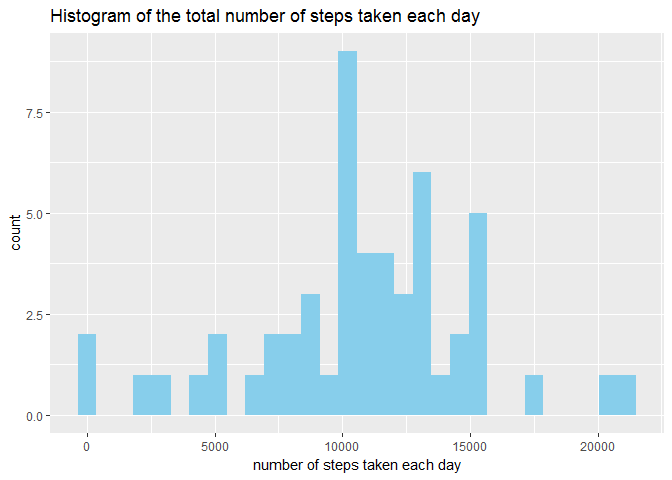
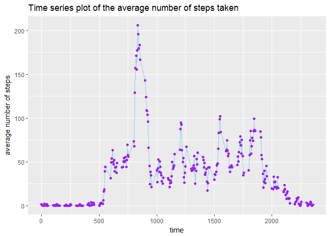
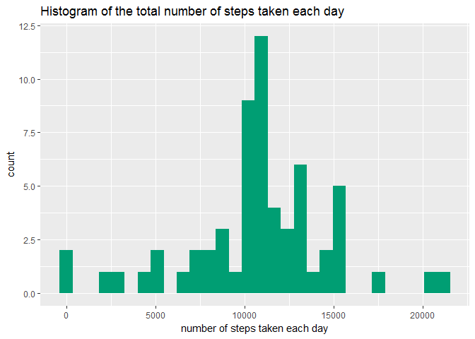
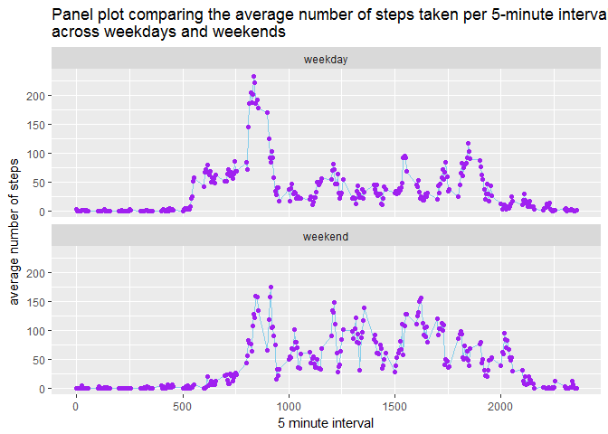

# PA1_template
B vStraaten  
4 september 2017  


# Peer-graded Assignment: Course Project 1

## monitoring personal activity

It is now possible to collect a large amount of data about personal movement using activity monitoring devices such as a Fitbit, Nike Fuelband, or Jawbone Up. These type of devices are part of the "quantified self" movement - a group of enthusiasts who take measurements about themselves regularly to improve their health, to find patterns in their behavior, or because they are tech geeks. But these data remain under-utilized both because the raw data are hard to obtain and there is a lack of statistical methods and software for processing and interpreting the data.

This assignment makes use of data from a personal activity monitoring device. This device collects data at 5 minute intervals through out the day. The data consists of two months of data from an anonymous individual collected during the months of October and November, 2012 and include the number of steps taken in 5 minute intervals each day.

Before we start, load the required packages


```r
library(readr)
library(ggplot2)
library(reshape)
library(xtable)
library(knitr)
library(dplyr)
```

```
## 
## Attaching package: 'dplyr'
```

```
## The following object is masked from 'package:reshape':
## 
##     rename
```

```
## The following objects are masked from 'package:stats':
## 
##     filter, lag
```

```
## The following objects are masked from 'package:base':
## 
##     intersect, setdiff, setequal, union
```


### load and explore data


```r
activity <- read_csv("~/activity.csv", na = "NA")
```

```
## Parsed with column specification:
## cols(
##   steps = col_integer(),
##   date = col_date(format = ""),
##   interval = col_integer()
## )
```

```r
summary(activity)
```

```
##      steps             date               interval     
##  Min.   :  0.00   Min.   :2012-10-01   Min.   :   0.0  
##  1st Qu.:  0.00   1st Qu.:2012-10-16   1st Qu.: 588.8  
##  Median :  0.00   Median :2012-10-31   Median :1177.5  
##  Mean   : 37.38   Mean   :2012-10-31   Mean   :1177.5  
##  3rd Qu.: 12.00   3rd Qu.:2012-11-15   3rd Qu.:1766.2  
##  Max.   :806.00   Max.   :2012-11-30   Max.   :2355.0  
##  NA's   :2304
```


### What is mean total number of steps taken per day?

Firstly, we'll calculate the total number of steps taken per day.


```r
tot_steps <- aggregate(steps ~ date, activity, sum)
```


```r
kable(tot_steps, caption = "Total number of steps taken per day")
```


Table: Total number of steps taken per day

date          steps
-----------  ------
2012-10-02      126
2012-10-03    11352
2012-10-04    12116
2012-10-05    13294
2012-10-06    15420
2012-10-07    11015
2012-10-09    12811
2012-10-10     9900
2012-10-11    10304
2012-10-12    17382
2012-10-13    12426
2012-10-14    15098
2012-10-15    10139
2012-10-16    15084
2012-10-17    13452
2012-10-18    10056
2012-10-19    11829
2012-10-20    10395
2012-10-21     8821
2012-10-22    13460
2012-10-23     8918
2012-10-24     8355
2012-10-25     2492
2012-10-26     6778
2012-10-27    10119
2012-10-28    11458
2012-10-29     5018
2012-10-30     9819
2012-10-31    15414
2012-11-02    10600
2012-11-03    10571
2012-11-05    10439
2012-11-06     8334
2012-11-07    12883
2012-11-08     3219
2012-11-11    12608
2012-11-12    10765
2012-11-13     7336
2012-11-15       41
2012-11-16     5441
2012-11-17    14339
2012-11-18    15110
2012-11-19     8841
2012-11-20     4472
2012-11-21    12787
2012-11-22    20427
2012-11-23    21194
2012-11-24    14478
2012-11-25    11834
2012-11-26    11162
2012-11-27    13646
2012-11-28    10183
2012-11-29     7047

Let's see how the total number of steps is devided.


```r
plot1 <- ggplot(tot_steps, aes(steps)) +
        geom_histogram(bins = 30, fill = "sky blue") +
        xlab("number of steps taken each day") +
        ggtitle("Histogram of the total number of steps taken each day")
plot1
```

<!-- -->


```r
mean_steps <- format(mean(tot_steps$steps), scientific = FALSE)
median_steps <- median(tot_steps$steps)
```

The mean total number of steps taken per day is 10766.19, and the median is 10765.


### average daily activity pattern


Now let us explore how activity is devided over the day with a time-series plot, showing the the average number of steps over a 5 minute interval.


```r
avg_steps <- aggregate(steps ~ interval, activity, mean)

plot2 <- ggplot(avg_steps, aes(interval, steps)) +
        geom_line(color = "sky blue") +
        geom_point(color = "purple") +
        ylab("average number of steps") +
        xlab("time") +
        ggtitle("Time series plot of the average number of steps taken")
plot2
```

<!-- -->


```r
avg_int <- aggregate(steps ~ interval, activity, mean)
max_steps <- avg_int[which.max(avg_int$steps), "interval"]
```

The interval with the maximum number of step on average across all the days in the dataset is 835.

### Imputing missing values


```r
missing <- nrow(activity[!complete.cases(activity), ]) 
missing_perc <- sprintf("%.1f %%", 100*nrow(activity[!complete.cases(activity), ]) / nrow(activity))
```

The total number of missing values in the dataset (i.e. the total number of rows with NAs) is 2304, which is 13.1 % of the total data.

Now let's replace the missings for the mean of all the non-missings.


```r
activity2 <- activity # create copy
activity2$steps[is.na(activity2$steps)] <- mean(activity2$steps, na.rm = TRUE)
summary(activity2)
```

```
##      steps             date               interval     
##  Min.   :  0.00   Min.   :2012-10-01   Min.   :   0.0  
##  1st Qu.:  0.00   1st Qu.:2012-10-16   1st Qu.: 588.8  
##  Median :  0.00   Median :2012-10-31   Median :1177.5  
##  Mean   : 37.38   Mean   :2012-10-31   Mean   :1177.5  
##  3rd Qu.: 37.38   3rd Qu.:2012-11-15   3rd Qu.:1766.2  
##  Max.   :806.00   Max.   :2012-11-30   Max.   :2355.0
```

Now let's plot a histogram of the total number of steps taken each day after missing values are imputed


```r
tot_steps2 <- aggregate(steps ~ date, activity2, sum)

plot3 <- ggplot(tot_steps2, aes(steps)) +
        geom_histogram(bins = 30, fill = "#009E73") +
        xlab("number of steps taken each day") +
        ggtitle("Histogram of the total number of steps taken each day")
plot3
```

<!-- -->


```r
mean_steps2 <- format(mean(tot_steps2$steps), scientific=FALSE)
median_steps2 <- format(median(tot_steps2$steps), scientific = FALSE)
```

After imputing the missing values the mean total number of steps taken per day is 10766.19, and the median is 10766.19.

Obviously we see a big increase in the middel of the histogram where we have replaced the missings with the mean value of all the non missings. The mean however, will remain the same. The median will shift slightly up. This imputing strategy will lead to less variance and more centric data.

We could also use a package like Mice for mor sophisticated imputations). See also; https://www.r-bloggers.com/missing-value-treatment/

### Are there differences in activity patterns between weekdays and weekends?

We will create a new factor variable in the dataset with two levels - "weekday" and "weekend" indicating if a given date is a weekday or weekend day.


```r
activity$day <- weekdays(activity$date)
activity$day2 <- activity$day
activity$day2[activity$day == "zaterdag"] <- "weekend"
activity$day2[activity$day == "zondag"] <- "weekend"
activity$day2[activity$day == "maandag"] <- "weekday"
activity$day2[activity$day == "dinsdag"] <- "weekday"
activity$day2[activity$day == "woensdag"] <- "weekday"
activity$day2[activity$day == "donderdag"] <- "weekday"
activity$day2[activity$day == "vrijdag"] <- "weekday"
```

Now we'll calculate the mean steps per interval and day 

```r
avg_int2 <- aggregate(steps ~ interval + day2, activity, mean)
```

Lastly, we'll make a time series plot containing the 5-minute interval (x-axis) and the average number of steps taken, averaged across all weekday days or weekend days (y-axis). 


```r
plot4 <- ggplot(avg_int2, aes(interval, steps)) +
        geom_line(color = "sky blue") +
        geom_point(color = "purple") +
        ylab("average number of steps") +
        xlab("5 minute interval") +
        ggtitle("Panel plot comparing the average number of steps taken per 5-minute interval \nacross weekdays and weekends") +
        facet_wrap(~ day2, ncol = 1)
plot4
```

<!-- -->

In this plot we can clearly see that the average daily activity pattern is different in weekdays as compared to weekends:

* in weekdays we see activty earlier (damn alarm clock)

* in weekdays we see a higher activity spike in the morning (morning run)

* in weekdays we see less activity during the day (office time)

* in weekdays we see less activty in the evening (tired)

* in the weekends we see more activty in the evenings (beers 'n friends)

conclusion: weekends are more fun!


 
